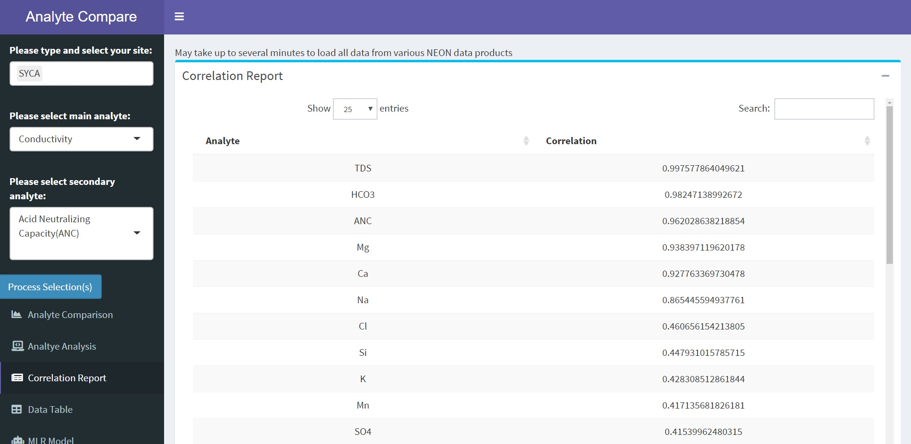
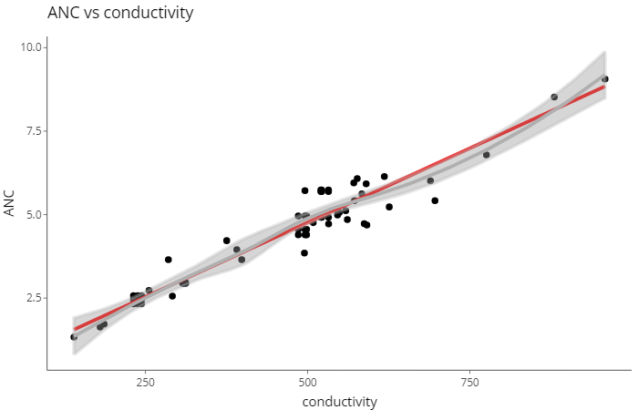

# Analyte Comparison (v2.0)

#### Timothy Gilbert (tsgilbert@arizona.edu)
## 2020-01-14

## About

This Shiny app uses **National Ecological Observatory Network** [(NEON data portal)](https://data.neonscience.org/) to compare analyte concentrations using **Surface Water Chemistry** [(SWC)](https://data.neonscience.org/data-products/DP1.20093.001#about) sampling across various NEON [sites](https://www.neonscience.org/field-sites/field-sites-map) across the United States. Start by selecting a date range, aquatic field site, and two analytes to examine, then click **Process Selection(s)**. More information on the data collection process can be found by clicking on [SWC](https://data.neonscience.org/data-products/DP1.20093.001#about) anywhere in this document. More information on the NEON project can by clicking [here](https://www.neonscience.org/).<!-- Two spaces apart -->

## Comparison Plot

This app allows you to select an Aquatic Field site, dates, and two analytes to compare, one '**main**' and another a secondary component. The data is pulled directly from the NEON database from the selected date range and plotted through time on a dual y-axis plot. The plot auto scales to allow for pattern detection between the various analytes. The plot is interactive and provides the exact sampling dates and concentrations.


## Correlation Report

The Correlation Report tab uses the '**main**' analyte chosen and calculates correlation compared to every other analyte independently.




```{r, eval=FALSE}
# list of analyes being evaluated
alist<- c('ANC','Br','Ca','Cl','CO3','conductivity','DIC','DOC','F','Fe','HCO3','K','Mg','Mn','Na','NH4 - N','NO2 - N','NO3+NO2 - N','Ortho - P','pH','Si','SO4','TDN','TDP','TDS','TN','TOC','TP','TPC','TPN','TSS','TSS - Dry Mass','UV Absorbance (250 nm)','UV Absorbance (280 nm)')
    
    # empty table to store correlation results
    correlation <- data.table(Analyte=character(),Correlation=numeric())

    # main analyte selected data
    analyte_data<- External.data %>%
      filter(analyte == select.analyte) %>%
      select(analyte, analyteConcentration, collectDate) %>%
      arrange(collectDate)
    
    i=1
    while (i < length(alist)+1 ) {
      # goes through all analytes and saves data
      analyte_dataB<- External.data %>%
        filter(analyte == alist[i]) %>%
        select(analyte, analyteConcentration, collectDate) %>% 
        arrange(collectDate)
      # joins analyte data together by collect date
      analytes<- left_join(analyte_data, analyte_dataB, by= 'collectDate')
      
      # saves correlation # into table
      correlation[[i,2]]<- cor(analytes$analyteConcentration.x, analytes$analyteConcentration.y)
      # saves 2nd analyte being evaluated into table
      correlation[[i,1]]<- paste0(analytes$analyte.y[1])
      i=i+1
    }
    # organizing data
    correlation<- correlation %>%
      arrange(desc(Correlation))
    
    i=1
    # if no value is produced...
    while (i < length(alist)+1 ) {
    if(is.na(correlation[[i,2]])) {
      correlation[[i,2]]<- ('Not enough data')
    }
      i=i+1
    }
    # take out 'main' analyte that is being compared to the rest
    correlationA<- correlation %>%
      filter(Analyte != select.analyte)
```

_Some sites may not have enough data points for certain analytes and do not produce a correlation result. Therefore the table will print 'Not enough data'_


## Regression Analysis

The Analysis tab plots out the two selected analyte concentrations through linear regression (lm). Below that the summary is taken for the relationship between the two analytes and the R^2 and P-value is printed out. Data points are paired by collection date of samples taken.

```{r, eval=FALSE}
    # portion of code for plotting linear regression of two analytes
    sct_base<-ggplot(analytes,aes(y = analyteConcentration.y,x = analyteConcentration.x))
    d.plot<- sct_base+geom_point()+
      geom_smooth(method = "lm",se = F, color = "Red", show.legend = T, formula = 'y ~ x', na.rm = F)+
      geom_smooth(color = "Grey", show.legend = T, inherit.aes = T)+
      theme_classic()+
      ggtitle(paste0(analytes$analyte.y[1],' vs ',analytes$analyte.x[1]))+
      xlab(analytes$analyte.x[1])+
      ylab(analytes$analyte.y[1])
    
    # portion of code for summary of linear regression (for P-value)
    mdl_1<-lm(analyteConcentration.y ~ analyteConcentration.x,data = analytes)
    summary(mdl_1)
```


